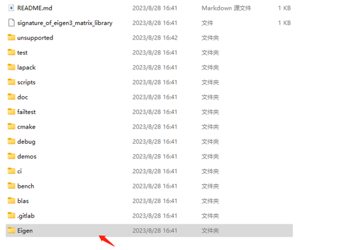
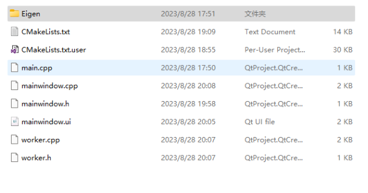
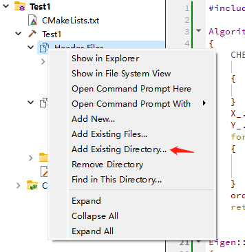
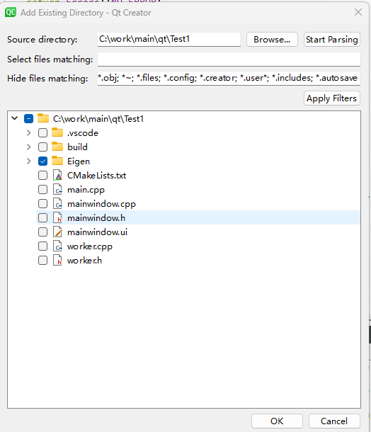
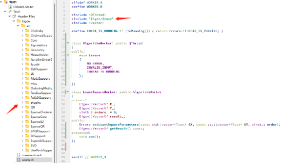

# 附录：算法示例代码

[Eigen](https://eigen.tuxfamily.org/index.php?title=Main_Page)库是一个非常强大的矩阵运算工具库，集成了大量矩阵算法。Eigen库只包括头文件，而不需要其他依赖，因此在项目中引入和使用它是非常方便的。

## 引入Eigen

* 从官网下载最新的[Eigen文件](https://gitlab.com/libeigen/eigen/-/archive/3.4.0/eigen-3.4.0.zip)，或者直接使用作业文档包示例代码中的`Eigen`目录。

* 解压后，将Eigen目录整体复制到项目文件夹下：
  
  
  
  
  
  （图中展示的是CMake构建的项目，qmake构建项目也同理）

* 在qt creator中，右键Header Files，点击Add Existing Directory
  
  

* 然后勾选Eigen目录，点击确认
  
  

* 完成后，可以在项目中看到该库的所有文件；之后在代码中#include "Eigen/Dense"，就可以在项目中使用Eigen相关功能了。下文中的示例代码也是使用Eigen的库函数完成的，引入Eigen、<vector>和<iostream>等依赖后，将示例代码复制到你的项目中，即可使用。
  
  

## 基于Eigen的算法代码

在你的项目中，你**可以直接使用给出的示例算法代码**完成可视化所需数据的计算；你也可以根据给出的参考文献或其他课上学到的知识自己完成算法部分的工作。以下代码省略了引入头文件的部分，运行它们需要的头文件为：

```cpp
#include "Eigen/Dense"
#include <vector>
#include <iostream>
```

### 均值和方差的计算

这部分代码见`rowfeature.hpp`。

```cpp
std::tuple<float, float> getAvgVar(const std::vector<float> &inX);
```

`getAvgVar`以数据的一列作为输入，计算它们的均值和方差。它的调用方式如下：

```cpp
void testAvgVar()
{
    std::vector<float> x = {1, 2, 3, 4, 5};
    auto avgVar = getAvgVar(x);
    std::cout << "avgVar: " << std::get<0>(avgVar) << " " << std::get<1>(avgVar) << std::endl;
}

// will print:
/*
avgVar: 3 2.5
*/
```

### 曲线拟合（最小二乘法）的计算

这部分代码见`leastsquare.hpp`。

```cpp
std::tuple<Eigen::VectorXf, float, float>
fitLeastSquareAndPR(const std::vector<float> &inX, const std::vector<float> &inY, const int inDegree);
```

`fitLeastSquareAndPR`的参数`inX`和`inY`分别为参与拟合的自变量数组和因变量数组，`inDegree`为拟合多项式的阶数。

返回的三元组中，第一项为拟合得到$y=\theta_0 + \theta_1 x + \theta_2 x^2 + ... + \theta_{n}x^n$中的$[\theta_0, ..., \theta_n]$，第二项是拟合的$p$值，第三项是拟合的$r^2$值。

这里使用Householder QR分解方法求解，感兴趣的同学可以参考可以参考[这篇文章](https://zhuanlan.zhihu.com/p/559468951)。

调用方式如下：

```cpp
void testLesatSquare()
{
    std::vector<float> x = {1, 2, 3, 4, 5};
    std::vector<float> y = {1, 4, 9, 16, 25};

    auto res1 = fitLeastSquareAndPR(x, y, 1);
    std::cout << "res1: \n" << std::get<0>(res1) << std::endl;
    std::cout << "p = " << std::get<1>(res1) << std::endl;
    std::cout << "r2 = " << std::get<2>(res1) << std::endl;
    std::cout << std::endl;

    auto res2 = fitLeastSquareAndPR(x, y, 2);
    std::cout << "res2: \n" << std::get<0>(res2) << std::endl;
    std::cout << "p = " << std::get<1>(res2) << std::endl;
    std::cout << "r2 = " << std::get<2>(res2) << std::endl;
    std::cout << std::endl;

    auto res3 = fitLeastSquareAndPR(x, y, 3);
    std::cout << "res3: \n" << std::get<0>(res3) << std::endl;
    std::cout << "p = " << std::get<1>(res3) << std::endl;
    std::cout << "r2 = " << std::get<2>(res3) << std::endl;
    std::cout << std::endl;
}

// will print:
/*
res1:
-7
 6
p = 14
r2 = 0.962567

res2:
0
0
1
p = 0
r2 = 1

res3:
  1.8425e-07
-3.81697e-07
           1
-3.99499e-08
p = 4.55103e-12
r2 = 1

*/
```

### 协方差矩阵和相关系数矩阵的计算

这部分代码见`covariance.hpp`。

```cpp
Eigen::MatrixXf getCovariance(const std::vector<std::vector<float>> &inMat);
Eigen::MatrixXf getPearsonCorr(const Eigen::MatrixXf &cov, const std::vector<float> &vars);
```

`getCovariance`接受一个`vector`作为输入，这个`vector`由`vector<float>`组成，而每个`vector<float>`代表一**列**数据，该函数会计算输入各列的协方差矩阵。

`getPearsonCorr`接受`getCovariance`和各列的方差（见**均值和方差的计算**一节）作为输入，计算Pearson相关系数矩阵。

关于协方差矩阵和相关性矩阵，可以参考这两篇文章：[知乎文章1](https://www.zhihu.com/question/20852004/answer/134902061)；[知乎文章2](https://zhuanlan.zhihu.com/p/447830310)。

上述函数的调用方式如下：

```cpp
void testCovariance()
{
    std::vector<std::vector<float>> mat = {
        {1.2f, 2.3f, 3.4f, 8.8f},
        {4.5f, 5.6f, 6.7f, 7.2f}
    };

    auto cov = getCovariance(mat);
    std::cout << "cov: \n" << cov << std::endl;

    std::vector<float> vars;
    for (auto vec : mat)
    {
        auto avgVar = getAvgVar(vec);
        vars.push_back(std::get<1>(avgVar));
    }
    auto rel = getPearsonCorr(cov, vars);
    std::cout << "pearson corr: \n" << rel << std::endl;
}

// will print:
/*
cov:
11.3692 3.40667
3.40667 1.44667
pearson corr:
       1 0.840004
0.840004        1
*/
```

### KMeans聚类算法

这部分代码见`kmeans.hpp`。

```cpp
std::tuple<Eigen::MatrixXf, std::vector<int>>
clusterKMeans(const std::vector<std::vector<float>> &in, const int k, const int maxIter);

std::tuple<Eigen::MatrixXf, std::vector<int>>
clusterKMeans(const std::vector<std::vector<float>> &in, const int k)
{
    return clusterKMeans(in, k, 100);
}
```

`clusterKMeans`的输入`in`为一个`vector`，该`vector`由`vector<float>`组成，每个`vector<float>`为一个等待聚类的数据点。我们要求所有的点维数相同。

KMeans是一个迭代求解算法，我们可以限制迭代总次数`maxIter`来节约执行时间，注意过小的`maxIter`会导致聚类未完成。

函数将返回一个元组，其第一项为生成的`k`个聚类中心，第二项为对输入所有数据点的分类。

更多关于KMeans和聚类算法的资料，可以参考[这篇文章](https://zhuanlan.zhihu.com/p/184686598)和[这篇博客](https://blog.csdn.net/duxingzheyun/article/details/107016053)。

上述函数的调用方式如下：

```cpp
void testCluster()
{
    std::vector<std::vector<float>> points = {
        {1, 2},
        {2, 1},
        {3, 1},
        {5, 4},
        {5, 5},
        {6, 5},
        {10, 8},
        {7, 9},
        {11, 5},
        {14, 9},
        {14, 14},
        {15, 11}
    };

    auto res = clusterKMeans(points, 3);
    std::cout << "centers: \n" << std::get<0>(res) << std::endl;
    std::cout << "labels: \n";
    for (auto &label : std::get<1>(res))
    {
        std::cout << label << " ";
    }
    std::cout << std::endl;
}

// will print:
/*
centers:
3.66667       3
9.33333 7.33333
14.3333 11.3333
labels:
0 0 0 0 0 0 1 1 1 2 2 2
*/
```

### PCA降维算法

这部分代码见`pca.hpp`。

```cpp
Eigen::MatrixXf pca(const std::vector<std::vector<float>> &in, const int k);
```

`pca`的输入`in`为一个`vector`，该`vector`由`vector<float>`组成，每个`vector<float>`为一个等待降维的高维数据点。我们要求所有的点维数相同。`k`为目标维数。

函数的输出为降维完成后的所有点。

关于`pca`降维的相关资料，可以参考[这篇文章](https://zhuanlan.zhihu.com/p/77151308)；另外SVD也是一种常用的降维算法实现，可以参考[这里](https://zhuanlan.zhihu.com/p/148118882)和[这里](https://zhuanlan.zhihu.com/p/92507652)。

该函数的调用方法如下：

```cpp
void testPCA()
{
    std::vector<std::vector<float>> highDimPoints = {
        {2.5f, 1.2f, 0.01f},
        {3.5f, 2.5f, 0.011f},
        {4.5f, 3.5f, 0.012f},
        {5.5f, 4.5f, 0.013f},
        {6.5f, 5.5f, 0.014f},
        {7.5f, 6.5f, 0.015f},
        {8.5f, 7.5f, 0.016f},
        {9.5f, 8.5f, 0.017f},
        {10.5f, 9.5f, 0.018f},
        {11.5f, 10.5f, 0.019f},
        {12.5f, 11.5f, 0.020f},
        {13.5f, 12.5f, 0.021f},
        {14.5f, 13.5f, 0.022f},
        {15.5f, 14.5f, 0.023f},
        {16.5f, 15.5f, 0.024f},
        {17.5f, 16.5f, 0.025f},
        {18.5f, 17.5f, 0.026f},
        {19.5f, 18.5f, 0.027f},
        {20.5f, 19.5f, 0.028f},
        {21.5f, 20.5f, 0.029f},
        {22.5f, 21.5f, 0.030f},
        {23.5f, 22.5f, 0.031f},
        {24.5f, 23.5f, 0.032f},
        {25.5f, 24.5f, 0.033f},
        {26.5f, 25.5f, 0.034f},
        {27.5f, 26.5f, 0.035f},
        {28.5f, 27.5f, 0.036f},
        {29.5f, 28.5f, 0.037f}
    };
    auto res = pca(highDimPoints, 2);
    std::cout << "res: \n" << res << std::endl;
}

// will print:
/*
res:
  -0.182988    -19.2967
  0.0273254    -17.6701
  0.0257449    -16.2559
   0.024164    -14.8417
  0.0225835    -13.4274
   0.021003    -12.0132
   0.019422     -10.599
  0.0178415     -9.1848
  0.0162608    -7.77059
  0.0146801    -6.35637
  0.0130996    -4.94216
  0.0115187    -3.52795
 0.00993826    -2.11374
  0.0083575   -0.699522
 0.00677683    0.714691
 0.00519608      2.1289
 0.00361559     3.54312
 0.00203475     4.95733
0.000454259     6.37154
-0.00112647     7.78576
-0.00270719     9.19997
-0.00428768     10.6142
-0.00586864     12.0284
-0.00744913     13.4426
-0.00902962     14.8568
 -0.0106111      16.271
 -0.0121906     17.6852
  -0.013772     19.0995
*/
```

### xgboost

这部分代码见`xgboost_example.h`。

错误处理：始终检查C API函数的返回值。在C应用程序中，可以使用以下宏来保护所有对XGBoost的C API函数的调用。该宏会打印所有发生的错误/异常：

```cpp
#define safe_xgboost(call) { \
int err = (call); \
    if (err != 0) { \
        fprintf(stderr, "%s:%d: error in %s: %s\\n", __FILE__, __LINE__, #call, XGBGetLastError()); \
        exit(1); \
} \
}
```

加载数据：可以使用`XGDMatrixCreateFromFile`函数从文件中加载数据，或者使用`XGDMatrixCreateFromMat`函数从内存中加载数据。

```cpp
    // Load data from memory
    float train[4][2] = {{1,2}, {3,4}, {5,6}, {7,8}};
    float label[4] = {0,1, 0, 1};
    DMatrixHandle dtrain;
    safe_xgboost(XGDMatrixCreateFromMat((float *) train, 4, 2, -1, &dtrain));
    safe_xgboost(XGDMatrixSetFloatInfo(dtrain, "label", label, 4)); // set label parameter
```

训练模型：可以使用`XGBoosterCreate`函数创建一个`Booster`对象，然后使用`XGBoosterSetParam`函数设置参数，最后使用`XGBoosterUpdateOneIter`函数进行迭代更新。

```cpp
    // Create booster
    BoosterHandle booster;
    safe_xgboost(XGBoosterCreate(&dtrain, 1, &booster));

    // Set parameters
    safe_xgboost(XGBoosterSetParam(booster, "objective", "reg:squarederror"));
    safe_xgboost(XGBoosterSetParam(booster, "max_depth", "3"));
    safe_xgboost(XGBoosterSetParam(booster, "eta", "0.1"));

    // Train for 10 iterations
    for (int iter = 0; iter < 2; iter++) {
        safe_xgboost(XGBoosterUpdateOneIter(booster, iter, dtrain));
    }
```

预测结果：可以使用`XGBoosterPredict`函数对测试数据进行预测，并获取预测值。                

```cpp
    // Use train data as test data
    DMatrixHandle dtest = dtrain;

    // Predict
    bst_ulong out_len;
    const float* out_result;
    safe_xgboost(XGBoosterPredict(booster, dtest, 4, 2, 0, &out_len, &out_result));

    // Print predictions
    for (int i = 0; i < out_len; i++) {
        printf("%f\n", out_result[i]);
    }
```

归因分析：可以使用`XGBoosterPredict`函数设置`pred_contribs`参数为1，来获取每个特征对预测值的贡献度

```cpp
    safe_xgboost(XGBoosterPredict(booster, dtest, 4, 2, 1, &out_len, &out_result));

    // Print feature contributions
    for (int i = 0; i < out_len; i++) {
        printf("%f\n", out_result[i]);
    }
```

